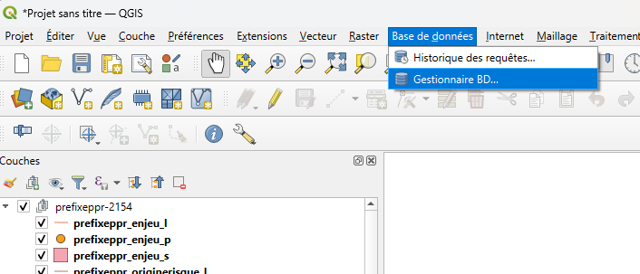
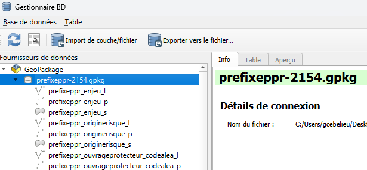
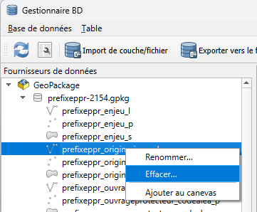
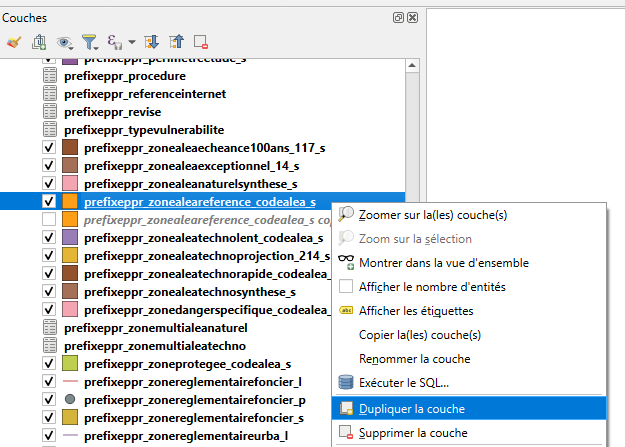
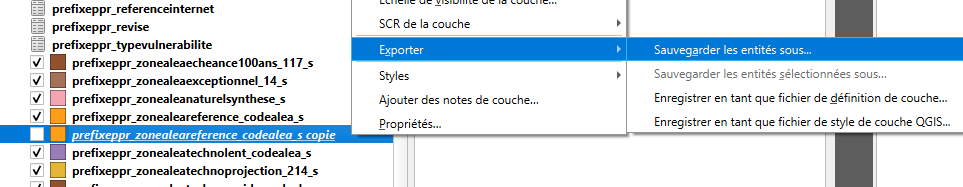
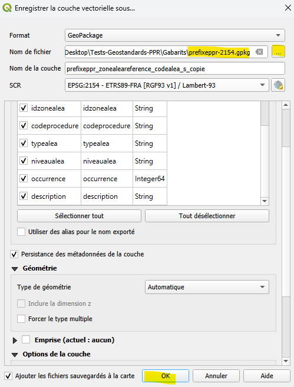
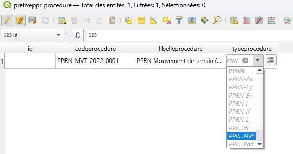
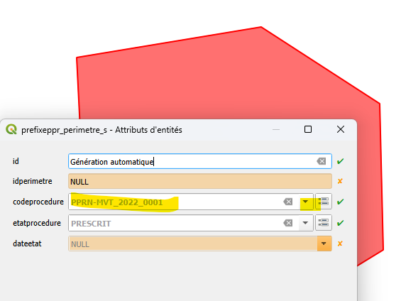

# FAQ Standard PPR

Cette page liste quelques questions fréquentes relatives au standard et l'utilisation des ressources associées.

## Utilisation des gabarits GeoPackage

### Personnalisation des gabarits pour constituer un PPR

Les gabarits proposés au format GeoPackage contiennent l'ensemble des tables décrites par le standard et avec un nommage générique :

* pour le nom du gabarit : [prefixeppr]-[code-epsg-territoire].gpkg
* pour les noms de table : \[prefixeppr\]\_nom_de_la_table\_\[suffixe-eventuel-codalea\]\_\[suffixe-type-de- geometrie\]

Pour créer le fichier PPR et les tables souhaitées qu'il va contenir, il convient donc de personnaliser le gabarit en :

1. renommant le fichier à l'aide de l'identifiant GASPAR du PPR comme indiqué [ici](../standard/Document.md#nom-du-fichier-de-livraison) dans le standard ;
2. supprimant les tables qui ne seront pas nécessaire pour le PPR concerné ;
3. renommant les tables qui seront utilisés par le PPR concerné à l'aide du code GASPAR et du code aléa si besoin comme indiqué [ici](../standard/Document.md#nomenclature-des-tables) dans le standard
4. Pour les PPR multi aléas, il pourra aussi être nécessaire de dupliquer certaines tables ayant un suffixe \[codealea\] des gabarits.

Si le renommage du fichier gabarit est facilement réalisable, le renommage et la duplication des tables est plus délicat si l'on veut conserver l'intégrité du fichier GeoPackage et les relations entre tables. On expose ici deux méthodes pour le faire, à privilégier selon l'outillage et les connaissances techniques dont on dispose : (1) directement dans le fichier SQL de création des gabarits ou (2) en utilisant QGiS.

A noter qu'il peut être possible de faire autrement, mais cela n'a pas été testé.

#### Méthode 1 : Modification dans le code SQL

C'est la méthode à privilégier si vous êtes à l'aise en SQL et avez la possibilité de faire tourner le [script de génération des gabarits](./gabarits/genGabarits.sh) qui est sur le github.

Pour cela, la méthode générale est la suivante : 

1. clonez le dépot github sur votre machine
2. dans la copie locale du dépot rendez vous dans le répertoire `./ressources/gabarits`
3. ouvrez le fichier [prefixeppr.sql](./gabarits/prefixeppr.sql) qui est le script qui génère toutes les tables des gabarits.
   1. recherchez/remplacez "prefixeppr" par le prefixe de votre PPR ;
   2. supprimez les blocs de code qui créent les tables (et les insère dans les tables gpkg_content et gpkg_geometry_columns) dont vous n'avez pas besoin.
   3. Dupliquez les blocs de code des tables que vous avez besoin de dupliquer (tables d'aléas) et remplacez le suffixe `codealea` par le code alea gaspar correspondant au type d'aléa que vous avez à décrire (112, 117, ...)
4. Une fois le fichier modifié, lancez le script [genGabarits.sh](./gabarits/genGabarits.sh). Celui-ci devrait générer les gabarits GeoPackage avec les noms et les tables que vous avez conservés dans les répertoires 2154, 2972, etc... correspondant au code EPSG du territoire français associé. NB : cette opération nécessite l'installation d'un client bash ([Git bash](https://about.gitlab.com/fr-fr/blog/git-bash/) par exemple) et de [sqlite3](https://sqlite.org/).
5. Prenez le fichier gabarit correspondant au territoire qui vous concerne, renommez le et utilisez le !

#### Méthode 2 : En utilisant QGiS

Si vous avez des difficultés à mettre en oeuvre la méthode précédente, vous pouvez manipuler les tables du gabarit à l'aide de QGiS.

Ce qui suit a été testé avec QGiS v3.44, il conviendra le cas échéant d'adapter les instructions en fonction de la version utilisée.

1. Téléchargez le gabarit qui correspondant à votre territoire depuis le [dépôt Github](./gabarits/) ;
2. Renommez le fichier en fonction du code CASPAR de votre PPR ;
3. Chargez le dans QGiS (drag n drop par exemple) ; sélectionnez toutes les couches proposées et ajoutez les au projet ;

La difficulté avec QGiS est que la manipulation des couches (renommage, copie, suppression) dans le gestionnaire de couches ne modifie pas le fichier GeoPackage sous-jacent (et inversement). Il faut jongler avec l'outil "Base de données / Gestionnaire BD..." de QGiS pour cela. 

Je n'ai pas trouvé de méthode plus simple avec QGiS. Si vous en avez n'hésitez pas à l'indiquer en PR ou Issue dans le github pour l'intégrer ici.

4. Avec le Gestionnaire BD, dépliez la partie GeoPackage/nom-gabarit.gpkg et vous retrouvez l'ensemble des tables du fichier. C'est ici que vous allez pouvoir les manipuler de façon pérenne dans le fichier.
   

   1. **Supprimer une table** : clic droit sur le nom de la table sélectionnez "Effacer..."
   
   **NB** : cette opération ne supprime pas la couche du gestionnaire de couches QGiS. Vous allez devoir aussi la supprimer de ce dernier avec un clic droit > "Supprimer la couche"

   2. **Renommer une table** : clic droit sur le nom de la table sélectionnez "Renommer..." et saisissez le nom de la table
   **NB** : cette opération ne renomme pas la couche correspondante dans le gestionnaire de couche. Pour cela, il faut faire à nouveau clic droit > "Ajouter au canevas" pour la couche renommée apparaisse dans le gestionnaire de couche. Ensuite, dans ce dernier, vous devrez supprimer la couche portant encore l'ancien nom avec un clic droit > "Supprimer la couche".

5. **Dupliquer et renommer une table**" : cette opération nécessite de revenir d'abord au gestionnaire de couches de QGiS.
   1. Dans le gestionnaire de couche : clic droit et choisissez "Dupliquer la couche"
   

   2. Pour pérenniser la couche qui a été créée dans le gestionnaire de couches il vous faut l'enregistre dans le fichier geopackage. Pour cela : clic droit, choisissez "Exporter... > Sauvegarder les Entités sous..."
   

   3. Dans la boite de dialogue qui apparaît, sélectionnez le fichier GeoPackage du gabarit pour y enregistrer la nouvelle couche. A priori il n'y a rien d'autre à modifier dans les options proposées. Cliquez sur OK.
   

   Vous pouvez ensuite retourner dans le gestionnaire de bases de donnés de QGiS pour renommer la table dans le GeoPackage (cf. étapes précédentes)

### Utilisation des gabarits dans QGiS

Une fois les gabarits renommés et préparés pour la saisie, il ne vous reste plus qu'à utiliser les outils pour remplir le PPR.

Dans QGiS (mais certainement dans d'autres SIG), il convient de noter que les relations existantes entre tables implémentées dans le gabarit vont imposer un certain ordre pour la saisie :

Presque toutes les tables ont un lien via la clef étrangère `codeProcedure` avec la table `procedure`, il faut en premier saisir
une entité dans la table procedure avec un codeProcedure que vous pourrez saisir sans difficulté.

Ensuite, la saisie des autres entités fonctionnera car la valeur de codeProcedure de la table Procedure sera proposée, ce qui permettra de faire le lien.

Cela peut apparaître contraignant mais cela permet de conserver le contrôle de cette contrainte lors de la saisie.

NB : Par ailleurs les gabarits comprennent les tables d’énumérations, avec les liens
de clefs étrangères des champs énumérés vers ces tables, ce qui facilite la saisie des valeurs énumérées depuis les tables de
gabarits.

## Erreurs du validateur

A compléter